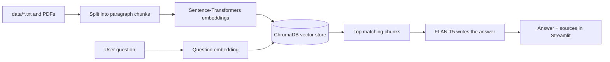

# Telangana 360: An AI-Based Telangana Knowledge Platform

Telangana 360 is a Streamlit web application that lets you explore Telangana's history, statehood movement, geography and culture. You can ask questions in plain English and get answers grounded in a curated knowledge base, or browse an interactive timeline, a map of key places and a quiz.

The chatbot uses **Retrieval-Augmented Generation (RAG)**: it finds the most relevant passages for your question and then writes a short answer from them. Every answer shows the source passages it used.

## Features

- **Home:** topic cards for Nizam Rule, Telangana Movement, Geography, and Culture and Heritage. Each card opens the chatbot with a ready question.
- **Chat:** RAG chatbot with quick-question buttons and an expandable "Sources used" section under every answer. AI answer writing can be switched off for faster, direct passages.
- **Timeline:** 27 events from 1163 to 2023, colour-coded by category (Heritage, Nizam era, Movement, Modern) with a category filter.
- **Map:** key historical places plotted on a map, with notes.
- **Quiz:** 10 multiple-choice questions with a progress bar, score, badge and correct answers for missed questions.
- **Extendable knowledge base:** add `.txt` or `.pdf` files to the `data/` folder and rebuild from the sidebar.

## How it works



1. Documents in `data/` are split into paragraphs (chunks).
2. Each chunk is converted into a vector with the `all-MiniLM-L6-v2` model and stored in ChromaDB.
3. A user question is converted into a vector and compared with the stored chunks by cosine similarity.
4. The closest chunks are passed to `google/flan-t5-base`, which writes a short answer.
5. If no chunk is close enough, the app says it could not find the answer instead of guessing.

## Tech stack

| Area | Tools |
|---|---|
| Language | Python 3.12 |
| Web app | Streamlit, HTML and CSS |
| Embeddings | sentence-transformers (`all-MiniLM-L6-v2`) |
| Vector database | ChromaDB |
| Answer generation | transformers (`google/flan-t5-base`), PyTorch |
| Data handling | pandas, numpy, pypdf, scikit-learn |
| Utilities | requests, python-dotenv |

## Project structure

```
Telangana360/
├── app.py              # Streamlit interface: Home, Chat, Timeline, Map, Quiz
├── rag.py              # RAG engine: chunking, embeddings, retrieval, answer generation
├── features.py         # Data for the timeline, map and quiz pages
├── requirements.txt    # Python dependencies
├── data/
│   ├── nizam_rule.txt
│   ├── telangana_movement.txt
│   ├── geography.txt
│   └── culture_heritage.txt
└── README.md
```

## Installation

**Requirements:** Python 3.12 and an internet connection for the first run.

```bash
# 1. Clone the repository
git clone https://github.com/<your-username>/<your-repo>.git
cd <your-repo>

# 2. Create and activate a virtual environment (Windows)
python -m venv venv
venv\Scripts\activate

# On Mac or Linux use:
# source venv/bin/activate

# 3. Install dependencies
python -m pip install --upgrade pip
pip install -r requirements.txt
```

## Run the app

```bash
python -m streamlit run app.py
```

The app opens at `http://localhost:8501`.

**First run:** the first chatbot question downloads two models from Hugging Face (about 90 MB for the embedding model and about 1 GB for FLAN-T5). This happens once. If your computer is slow, change `GEN_MODEL` in `rag.py` to `google/flan-t5-small`, or turn off "Write chat answers with AI" in the sidebar.

## Adding your own knowledge

1. Add a `.txt` or `.pdf` file to the `data/` folder.
2. For text files, separate paragraphs with a blank line. Each paragraph becomes one searchable chunk, so keep each one about a single topic.
3. Click **Rebuild knowledge base** in the sidebar.

To edit the timeline, map places or quiz questions, change the lists in `features.py`.

## Configuration

| Setting | File | Purpose |
|---|---|---|
| `GEN_MODEL` | `rag.py` | Model that writes answers (`flan-t5-base` or `flan-t5-small`) |
| `MAX_DISTANCE` | `rag.py` | Matching strictness. Raise it if the bot says "not found" too often, lower it if it answers unrelated questions |
| `k` in `retrieve()` | `rag.py` | Number of passages retrieved per question |

## Limitations

- The knowledge base is small and was written for a student project. Dates, names and figures should be verified against authoritative sources before use.
- FLAN-T5 is a small model, so answers are short and can occasionally miss detail. The "Sources used" section always shows the underlying text.
- Map locations are approximate.
- The app answers in English only.

## Future improvements

- Telugu question support with a multilingual embedding model.
- A personalities page (Komaram Bheem, Chakali Ailamma, Salar Jung and others).
- District-wise pages for all 33 districts.
- A festival calendar and an "On this day" card.
- A larger knowledge base built from verified documents.

## Author

**Sai Preethi Sathi**
B.Tech Data Science, MRECW

